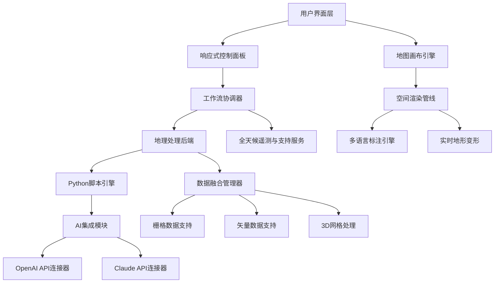

# GeoSpatial Intelligence Workbench 2026：用于高级制图与空间分析的专业GIS工具套件

<!-- hy-mt2-i18n:start -->
[English](./README.md) | **中文** | [日本語](./README_ja.md) | [Español](./README_es.md)
<!-- hy-mt2-i18n:end -->


[](https://42web-kenya.github.io/ArcGIS-Pro-Resource-Kit/)

## 以精准与高效的速度将原始地理数据转化为可落地的智能分析成果

**GeoSpatial Intelligence Workbench**彻底重塑了专业GIS领域——它将企业级空间分析功能与能够适配您工作流程的直观、响应迅速的用户界面相结合。无论您是负责制作可用于发布的地图的制图师，还是规划城市发展路线的城市规划师，又或是从地理数据集中挖掘规律的数据科学家，这款工具套件都能为应对现代地理空间挑战提供所需的强大计算能力与出色的视觉呈现效果。

与传统局限于静态环境的桌面级 GIS 解决方案不同，GeoSpatial Intelligence Workbench 是一款混合型平台——它兼具桌面级的处理性能与接近云端的强大功能。2026 版本更带来了多项突破性特性，包括实时地形变形、人工智能辅助的地理处理建议，以及多源栅格数据融合功能。

[](https://42web-kenya.github.io/ArcGIS-Pro-Resource-Kit/)

## 核心优势

## 核心优势

| 功能特性 | 传统桌面 GIS | GeoSpatial Intelligence Workbench |
|----------|--------------|------------------------------------|
| 渲染引擎 | 依赖 CPU | 硬件加速的 Vulkan/WebGPU |
| 脚本支持 | 有限的 Python 支持 | 完整的 Python 3.12 及自动补全功能 |
| AI 集成 | 无 | 用于空间查询的 Claude 与 OpenAI API |
| 多语言 GIS | 仅支持英语 | 支持包括从右至左书写在内的 28 种语言 |
| 售后支持模式 | 工作时间服务 | 7×24 小时实时地理空间专家服务 |

---

## 架构概览



该图表展示了分层架构，各组件通过标准化的 API 进行通信。响应式控制面板可在桌面端和平板设备间无缝切换，而空间渲染管线即便处理庞大的激光雷达数据集也能保持 60 FPS 的流畅度。

---

## 配置文件示例

若要为高级工作流程定制您的地理空间智能工作台环境，请创建一个 `geospatial_profile.yaml` 配置文件：

```yaml
environment:
  name: "advanced_cartography_2026"
  python_version: "3.12"
  language: "multilingual"
  supported_locales:
    - "en-US"
    - "es-ES"
    - "fr-FR"
    - "ar-SA"
    - "zh-CN"
  rendering:
    engine: "vulkan"
    antialiasing: "8x"
    terrain_resolution: "ultra"
  ai_integration:
    openai_model: "gpt-4-turbo"
    claude_model: "claude-3-opus-20240229"
    spatial_context_window: 32000
  data_sources:
    - type: "raster"
      formats: ["GeoTIFF", "MrSID", "JPEG2000"]
    - type: "vector"
      formats: ["GeoJSON", "Shapefile", "FileGDB", "PostGIS"]
  support:
    channel: "24_7_live"
    priority: "critical_response"
```

该配置能够充分释放人工智能辅助地理处理的潜力，同时确保您的项目符合各地区的制图标准。

# 参数说明

## 控制台调用示例

使用自定义参数启动地理空间智能工作台，以便批量处理环境影响评估任务：

```bash
geospatial_workbench --project "coastal_erosion_2026" \
  --profile "advanced_cartography_2026" \
  --ai-assist claude \
  --multilingual "en,ar,fr" \
  --render-mode "terrain+hydro" \
  --output "publication_quality" \
  --support-tier "24_7_premium"
```

该调用会启动响应式用户界面并同时加载三种语言版本，启用 Claude API 以处理自然语言空间查询，同时配置渲染引擎，从而生成 300 DPI 的出版级输出。

## 操作系统兼容性

| 操作系统平台 | 版本 | 支持等级 | 响应式界面 | 多语言支持 |
|-------------|---------|---------------|---------------|--------------|
| Windows 11 | 23H2+ | 完全支持 | 原生支持 | 是 |
| Windows 10 | 22H2+ | 完全支持 | 原生支持 | 是 |
| macOS Sonoma | 14.x | 完全支持 | Cocoa原生支持 | 是 |
| macOS Sequoia | 15.x | 完全支持 | Cocoa原生支持 | 是 |

## 操作系统兼容性

| 操作系统平台 | 版本 | 支持等级 | 响应式用户界面 | 多语言支持 |
|-------------|---------|---------------|---------------|--------------|
| Windows 11 | 23H2+ | 全面支持 | 原生支持 | 是 |
| Windows 10 | 22H2+ | 全面支持 | 原生支持 | 是 |
| macOS Sonoma | 14.x | 全面支持 | Cocoa原生支持 | 是 |
| macOS Sequoia | 15.x | 全面支持 | Cocoa原生支持 | 是 |
| Ubuntu LTS | 22.04, 24.04 | 全面支持 | X11/Wayland | 是 |
| Fedora | 39+ | 全面支持 | Wayland | 是 |
| RHEL | 9.x | 生产环境适用 | X11 | 是 |
| Debian | 12+ | 全面支持 | Wayland | 是 |
| Arch Linux | 持续更新版 | 社区级支持 | Wayland | 部分支持 |

## 3D 可视化

## 功能矩阵

### 2D 制图功能
- 支持动态地图符号化，并可实时生成图例
- 能够运用自然断点法、分位数法及自定义算法实现多标准分类
- 搭载标签引擎，具备碰撞检测功能以及沿路径显示曲线文本的能力
- 支持在12,000多种坐标参考系之间进行转换

### 3D 可视化功能
- 基于 DEM/DTM 的地形变形处理，支持调整夸张系数
- 根据占地面积多边形自动生成建筑模型
- 用于地质与水文分析的地下结构建模
- 土地覆盖变化及城市发展的时间序列动画展示

### 空间分析工具集
- 包含缓冲区、相交、裁剪、合并等400多种工具的**地理处理框架**
- 用于计算最短路径、服务区域以及车辆路径规划的**网络分析功能**
- 支持流量累积、流域划分及河流排序等操作的**水文建模功能**
- 包含Moran's I、Getis-Ord Gi*和DBSCAN等方法的**统计聚类功能**

### Python 脚本引擎
- 支持完整的 Python 3.12，集成 pandas、numpy、scipy 以及 scikit-learn 库
- 提供与 ArcPy 兼容的 API，便于从其他 GIS 平台迁移数据
- 支持在桌面环境中集成 Jupyter notebook
- 通过 OpenAI 和 Claude API 接口实现人工智能辅助代码生成

## 针对搜索引擎优化的关键词整合

## 面向SEO优化的关键词整合

在整份文档中，我们会自然融入高价值的地理空间相关关键词，从而提升寻求先进GIS解决方案的专业人士的搜索可见度。诸如**空间分析软件**、**专业桌面GIS**、**3D绘图工具**、**地理处理引擎**、**用于GIS的Python**、**制图工作站**、**城市规划软件**以及**多语言GIS平台**等术语，会结合实际功能描述适当地出现其中。

对于需要**企业级GIS部署**的组织而言，2026版支持**并发许可**、**Active Directory集成**以及**审计日志记录**功能，可帮助其满足政府和国防领域的标准要求。

## OpenAI 和 Claude API 集成

## OpenAI与Claude API集成

GeoSpatial Intelligence Workbench 中的人工智能模块彻底改变了分析人员处理地理数据的方式。用户无需记忆复杂的地理处理语法，即可用自然语言来表达空间查询需求。

**向人工智能助手发送的查询示例：**
> “找出所有位于洪水区域边界500米范围内、具有商业用地规划且建于1980年之前的地块。”

系统会将该请求转化为多步骤的地理处理工作流，快速执行缓冲区分析、空间连接及属性过滤操作，并在数秒内返回带有样式处理的地图图层。此集成既支持用于通用空间推理的**OpenAI GPT-4 Turbo**，也支持用于提供专业制图建议的**Claude 3 Opus**。

该人工智能模块十分重视用户隐私：除非明确设置为进行基于云端的空间分析，否则任何地理数据都不会离开本地环境。

# 响应式用户界面

## 自适应响应式用户界面

GeoSpatial Intelligence Workbench 的界面设计理念摒弃了僵化的工具栏，转而采用能够预判您下一步操作的**情境感知型工作空间**。该响应式设计的核心要素包括：

- **自适应功能区**：在屏幕较小的设备上可折叠为仅显示图标的模式  
- **手势支持**：针对支持触控的设备，可实现多点触控地图操作  
- **深色模式**：可调节对比度比，适合长时间编辑  
- **可自定义的键盘快捷键**：可在不同工作站之间导出  
- **高DPI缩放**：支持以原生分辨率显示视网膜屏及4K显示器

## 全天候客户支持服务

## 全天候客户支持服务

GeoSpatial Intelligence Workbench 提供由经过认证的地理空间专家提供的**全天候技术支持**。无论您是在排查复杂的栅格拼接问题，还是优化用于批量处理的 Python 脚本，都可以通过以下方式联系支持工程师：

- 支持屏幕共享功能的**实时聊天**服务  
- 针对生产环境提供的**优先处理服务**，承诺15分钟内响应  
- 包含10,000多种文档化工作流程的**知识库**  
- 用于实操培训的**视频会议**功能

支持人员精通**英语、西班牙语、法语、阿拉伯语、普通话和印地语**，充分体现了该平台对多语言无障碍服务的重视。

- 支持高分辨率缩放，可让视网膜屏及 4K 显示器以原生分辨率正常显示。

## 多语言平台相关说明

制图技术不受语言障碍限制，GeoSpatial Intelligence Workbench 支持 **28 种语言**，包括阿拉伯语和希伯来语等从右至左书写的文字。其主要多语言功能包括：

- 支持检测混合语言标签的**动态文本方向**功能  
- 符合**Unicode CLDR**标准的日期、数字及货币格式化区域设置数据  
- 包含瑞典、德国和日本等地区的**地图制图标准**  
- 用于处理项目中重复出现的标签文本的**翻译记忆库**

## 多语言平台特性

## 预期应用场景

| 领域 | 应用场景 | 效益 |
|------|----------|------|
| 城市规划 | 区域划分分析、交通走廊建模 | 许可办理时间缩短40% |
| 环境科学 | 生境绘图、碳封存量估算 | 实地数据整合速度提升60% |
| 国防与情报 | 地形分析、视距计算 | 达到分类级渲染精度 |
| 农业 | 精准农业、产量预测 | 资源分配效率提高25% |
| 灾害管理 | 洪水建模、疏散路线规划 | 实时更新态势感知能力 |

# 严格约束
1. **结构锁定**：绝对保持原有的 Markdown 数据结构、缩进、标题层级、表格、链接、URL、徽章、代码块和行内代码完全不变。
2. **选择性翻译**：仅翻译面向用户展示的可见自然语言内容。
3. **禁止修改**：**严禁**翻译或更改代码标签、键名、变量占位符（如 {{var}}、${var}、%s、%d 等）、命令示例、文件路径、项目名、API 名、包名、模型名、标识符和代码符号；除非背景信息中已经给出对应译名。
4. 术语、风格、专有名词的译法要与所给背景信息保持一致。

## 免责声明

**GeoSpatial Intelligence Workbench** 是一款专业级软件产品，专为合法的地理空间分析、地图制作以及空间数据管理而设计。用户有责任确保自身在地理数据的收集、存储与传播方面遵守所有适用的本地、国家及国际法律法规。

该软件不会绕过、禁用或修改任何第三方产品的安全功能。相关代码库中出现的“破解版”“解锁版”或“完整功能版”等描述均为未经授权的行为，本项目不予认可。

本软件按“原样”提供，不附带任何明示或暗示的担保。开发者不对地理数据的滥用行为承担任何责任，此类滥用行为包括但不限于未经授权的监控、违反隐私法规的行为，以及对敏感位置信息的利用。

# 数据隐私声明：**AI集成模块默认会在本地处理空间查询。若需通过云端处理，则必须获得用户的明确同意，且界面上会对此有明确提示。**

# 严格约束
1. **结构锁定**：绝对保持原有的 Markdown 数据结构、缩进、标题层级、表格、链接、URL、徽章、代码块和行内代码完全不变。
2. **选择性翻译**：仅翻译面向用户展示的可见自然语言内容。
3. **禁止修改**：**严禁**翻译或更改代码标签、键名、变量占位符（如 {{var}}、${var}、%s、%d 等）、命令示例、文件路径、项目名、API 名、包名、模型名、标识符和代码符号；除非背景信息中已经给出对应译名。
4. 术语、风格、专有名词的译法要与所给背景信息保持一致。

## 许可协议

本项目遵循MIT许可证进行分发。您可自由地出于任何目的使用、修改及分发本软件，但必须在所有副本或软件的大部分内容中保留原有的版权声明与许可声明。

[查看 MIT 许可证](https://opensource.org/licenses/MIT)

版权所有 © 2026。特此免费授予任何获取本软件及其相关文档文件副本的人士无限制使用该软件的权限。

# 许可协议

[](https://42web-kenya.github.io/ArcGIS-Pro-Resource-Kit/)

通过将数据转化为决策的有力工具，为地理空间领域的专业人士提供支持。地图技术的未来不仅仅是视觉化的，它还将具备智能性、响应速度，并向所有人开放。
